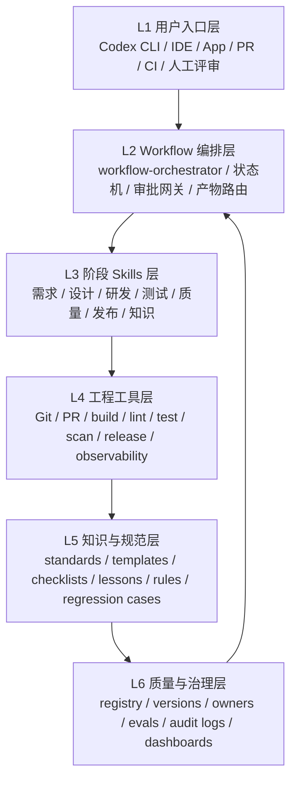

# 研发助手 Skills 工程体系落地方案

# 1. 执行摘要
目标是把需求、设计、研发、自测、质量门禁、代码走查、发布、复盘和知识沉淀转化为可独立运行、可编排、可校验、可审计、可版本化治理的 Codex Skills 工程资产。本次落地直接创建仓库结构、17 个 skill、统一 contract、output schema、eval cases、workflow node、workflow 样例、CI 样例、标准和检查清单。

边界：当前未接入真实组织系统、真实 CI/CD 平台和真实审批工具，默认以文件化 contract、GitHub Actions 样例和人工审批对象作为第一版落地接口。待组织确认项见本文件末尾。

# 2. 总体架构


模块职责：L1 提供触发入口；L2 负责编排、状态、审批和 artifact mapping；L3 执行阶段能力；L4 提供确定性工程检查；L5 提供规范和经验；L6 管理版本、owner、eval、审计和指标。

关键数据流：输入材料进入 `StageRunRequest`，skill 输出 `StageRunResult`，产物写入 `artifacts/<skill_id>/`，workflow 通过 `artifact-index.json` 路由给下游节点，知识 miner 从全链路产物抽取 rule candidates 和 regression cases。

关键控制流：`pending -> running -> succeeded|failed|blocked|waiting_for_input|waiting_for_human_review`。高风险动作进入人工审批网关，审批通过恢复运行，拒绝则 blocked 或 cancelled。

人工审批流：风险识别 -> 生成 `ApprovalRequest` -> 指定角色审批 -> 记录证据、时间、结果 -> 执行后续动作或拒绝策略。

产物流转图：

```mermaid
flowchart LR
  A[Requirement Contract] --> B[Design Docs]
  B --> C[Special Designs]
  C --> D[Design Review Gate]
  D --> E[Code Changes]
  E --> F[Self Test]
  F --> G[Code Quality Governor]
  G --> H[Code Review]
  H --> I[Release Readiness]
  I --> J[Release Verification]
  J --> K[Retrospective]
  K --> L[Knowledge Miner]
  L --> M[Standards / Checklists / Evals / Skill Patches]
```


# 3. 仓库结构
核心结构已创建：
- `skills/<skill-id>/SKILL.md`
- `skills/<skill-id>/contract.yaml`
- `skills/<skill-id>/output.schema.json`
- `skills/<skill-id>/scripts/validate_output.py`
- `skills/<skill-id>/evals/*.yaml`
- `skills/<skill-id>/workflow/node.yaml`
- `engineering-assistant/workflows/*.yaml`
- `engineering-assistant/standards/*.md`
- `engineering-assistant/checklists/*.md`
- `engineering-assistant/schemas/*.json`
- `engineering-assistant/scripts/*.py`
- `engineering-assistant/ci/github-actions/*.yml`
- `engineering-assistant/registry/*.yaml`

# 4. Skills 清单
| skill_id | 类型 | 触发场景 | 输入 | 输出 | 可独立运行 | 可编排 | 质量门禁 | 人工审批点 | owner 建议 |
|---|---|---|---|---|---|---|---|---|---|
| requirement-intake | stage_skill | 需求准入、需求边界确认、验收标准检查、进入设计前风险判断时使用；不要用于直接生成概要设计或代码实现。 | organization_context, current_process | requirement-intake-report.md, requirement-contract.json, missing-information-list.md | 是 | 是 | 业务目标存在; 验收标准存在 | 高风险需求; 跨系统重大依赖 | 产品/需求负责人 |
| repo-context-miner | stage_skill | 现有项目代码上下文梳理、模块边界识别、可复用能力识别、影响范围分析时使用；不要用于直接修改代码或替代设计评审。 | repository_path, requirement-contract.json | repo-context-report.md, module-map.yaml, impact-scope.yaml | 是 | 是 | 仓库路径可访问; 模块边界有证据 | 读取敏感配置; 跨仓库分析 | 架构师/资深开发 |
| high-level-design | stage_skill | 概要设计、系统上下文、模块边界、核心流程和架构风险分析时使用；不要用于直接编写类方法级详细设计。 | requirement-contract.json, team_standards | high-level-design.md, architecture-decision-record.md, module-boundary.yaml | 是 | 是 | 需求契约已准入; 模块边界明确 | 高风险架构决策; 跨域边界调整 | 架构师 |
| detailed-design | stage_skill | 详细设计、接口契约、实现任务拆解、测试策略和回滚策略设计时使用；不要用于替代数据库、Redis、MQ 专项设计。 | high-level-design.md, architecture-decision-record.md | detailed-design.md, implementation-plan.md, interface-contracts.yaml | 是 | 是 | 主详细设计只保留功能实现主线; 专项设计独立成文并在主文档引用 | 核心链路事务边界变化; 高并发路径设计 | 后端开发 |
| redis-design | stage_skill | Redis 设计、缓存 key 注册、TTL、数据结构、缓存一致性和 Redis 风险评估时使用；不要用于数据库或 MQ 设计。 | detailed-design.md, redis-standard.md | redis-design.md, redis-key-registry.yaml, cache-consistency-plan.md | 是 | 是 | redis-design.md 使用团队 Redis 模板; key 命名合规 | Redis key 批量删除; 核心链路缓存策略变化 | 架构师 |
| mq-design | stage_skill | MQ 设计、topic、routing key、消息体、生产消费链路、重试和死信策略设计时使用；不要用于 Redis 或数据库设计。 | detailed-design.md, mq-standard.md | mq-design.md, mq-topic-contract.yaml, message-schema.json | 是 | 是 | mq-design.md 使用团队 MQ 模板; 生产者表完整 | MQ topic 删除或重命名; MQ 新队列或 topic | 架构师 |
| database-design | stage_skill | 数据库设计、表结构、索引、迁移、修复和必要恢复方案设计时使用；不要用于缓存或消息队列专项设计。 | detailed-design.md, database-standard.md | database-design.md, schema-change-plan.sql, migration-plan.md | 是 | 是 | database-design.md 使用 OLTP 或 OLAP 团队模板; 字段和索引均有查询/约束用途 | DDL; 数据订正 | DBA |
| design-review | stage_skill | 设计评审、设计产物完整性检查、风险关闭和进入代码研发 gate 判断时使用；不要用于直接生成设计文档正文。 | high-level-design.md, detailed-design.md | design-review-report.md, review-findings.json, design-gate-decision.json | 是 | 是 | 无未关闭 blocker; 关键专项设计齐全 | 高风险设计放行; blocker 关闭确认 | 架构师 |
| frontend-design | stage_skill | 前端页面设计、组件边界、交互流程、接口联调契约和前端风险评估时使用；不要用于直接编写后端代码或替代 UI 视觉评审。 | requirement-contract.json, high-level-design.md | frontend-design.md, interaction-flow.md, component-contracts.yaml | 是 | 是 | 页面和组件边界明确; 接口联调契约明确 | 前端技术栈变更; 公共组件改造 | 前端开发 |
| code-development | stage_skill | 代码研发、按设计实施代码变更、生成实现总结和设计到代码映射时使用；不要用于无设计依据的大范围重构。 | detailed-design.md, implementation-plan.md | code changes, implementation-summary.md, design-to-code-mapping.yaml | 是 | 是 | 每个变更映射到设计; 无无关模块修改 | DB/Redis/MQ/权限/发布脚本变更; 核心链路实现偏离设计 | 后端开发 |
| frontend-development | stage_skill | 前端代码研发、页面/组件实现、接口联调、前端验证和 UI 变更总结时使用；不要用于后端业务逻辑实现。 | frontend-design.md, component-contracts.yaml | code changes, frontend-implementation-summary.md, design-to-ui-mapping.yaml | 是 | 是 | 每个 UI 变更映射到前端设计; 组件和状态边界符合现有项目 | 公共组件改造; 前端技术栈或组件库变更 | 前端开发 |
| implementation-controller | control_skill | 已审批设计需要编译成实现合同、控制代码执行范围、驱动质量命令和修复闭环时使用；不要用于未审批设计或单纯设计文档生成。 | approved design artifact, target project root | current-task.json, design-contract.json, implementation-contract.json | 是 | 是 | 设计合同已编译; 实现范围明确 | 修改已审批设计范围; 高风险实现豁免 | 研发负责人 |
| self-test | stage_skill | 自测、测试命令执行、覆盖率汇总、失败测试分析和发布前测试风险判断时使用；不要用于在测试失败时声明通过。 | implementation-summary.md, changed-files-report.json | self-test-report.md, test-commands.log, coverage-summary.md | 是 | 是 | 测试命令实际执行; 失败测试明确阻断 | 高风险测试豁免; 无法执行关键测试 | 测试负责人 |
| code-quality-governor | cross_cutting_skill | 代码质量门禁、PR 质量审计、代码变更风险评估、发布前质量检查时使用；不要用于单纯生成设计文档或没有代码变更的咨询。 | changed-files-report.json, design-to-code-mapping.yaml | code-quality-report.md, code-quality-report.html, code-quality-report.json | 是 | 是 | Q0 设计一致性; Q1 确定性工程检查 | 高风险未审批变更; 发布脚本变更 | 研发负责人 |
| code-review | stage_skill | 代码走查、人工评审辅助、语义缺陷定位和 blocker 清单整理时使用；不要用于替代确定性 CI 检查。 | code-quality-report.json, changed-files-report.json | code-review-report.md, code-review-report.html, review-comments.json | 是 | 是 | blocker 清单为空; 所有问题有证据 | blocker 关闭; 高风险人工豁免 | 研发负责人 |
| release-readiness | stage_skill | 发布准备、发布条件判断、回滚方案、灰度策略、监控和值班审批检查时使用；不要用于发布后验证。 | code-quality-report.json, code-review-report.md | release-plan.md, release-checklist.md, rollback-plan.md | 是 | 是 | 发布窗口明确; 回滚方案存在 | 生产发布; 生产配置变更 | 发布负责人 |
| release-verification | stage_skill | 发布后验证、生产检查、监控指标、异常列表和回滚条件判断时使用；不要用于发布前准备。 | release-plan.md, release-checklist.md | release-verification-report.md, production-checks.json, anomaly-list.md | 是 | 是 | 核心功能验证通过; 错误率/延迟未触发阈值 | 回滚操作; 生产验证豁免 | SRE |
| release-retrospective | stage_skill | 发布复盘、发布问题归纳、规范候选、skill 改进候选和后续行动整理时使用；不要用于发布审批。 | release-verification-report.md, code-quality-report.json | release-retrospective.md, release-lessons.yaml, follow-up-actions.md | 是 | 是 | 问题有证据; 行动项有 owner | 行动项关闭; 规范候选批准 | 发布负责人 |
| engineering-knowledge-miner | cross_cutting_skill | 研发经验总结、规范沉淀、评审问题归纳、事故复盘反哺、skill 规范更新建议时使用；不要用于直接执行代码质量检查或未经审批修改强制规范。 | design reports, code quality reports | engineering-lessons.md, rule-candidates.yaml, standard-patch-suggestions.md | 是 | 是 | 每条经验有来源证据; 规则默认 candidate | 修改正式团队规范; rule_candidate 标记为 approved | 规范 owner |
| skill-quality-auditor | audit_skill | 检查人工编写或 Agent 生成的 Codex Skills 质量、契约完整性、触发描述、eval 覆盖、workflow 兼容性时使用；不要用于执行业务研发阶段。 | skills, engineering-assistant/registry/skills.yaml | skill-quality-report.md, skill-quality-report.json, skill-fix-suggestions.md | 是 | 是 | SKILL.md 存在; description 清楚 | 高风险 skill 入库; 修改高风险质量门禁 | skill owner |
| workflow-orchestrator | workflow_skill | 研发流程编排、阶段选择、skills 串联执行、状态流转、人工审批和产物路由时使用；不要用于直接生成某个阶段文档。 | workflow.yaml, stage node registry | workflow-trace.json, workflow-summary.md, approval-requests.json | 是 | 是 | 节点 contract 匹配; 前置条件满足 | 人工审批网关; 跳过阻断节点 | workflow owner |

# 5. SkillContract 标准
标准模板已落地在每个 `contract.yaml`。必填字段包括：`skill_id`、`skill_name`、`version`、`stage`、`type`、`purpose`、`non_goals`、`trigger_description`、`standalone_mode`、`workflow_mode`、`inputs`、`outputs`、`preconditions`、`postconditions`、`dependencies`、`permissions`、`human_approval_required`、`risk_model`、`quality_gates`、`failure_modes`、`eval_cases`、`workflow_interface`、`owner`、`reviewers`、`change_policy`。

# 6. SKILL.md 标准模板
每个 `SKILL.md` 均包含 front matter，并包含：`Role`、`Scope`、`Non-goals`、`Inputs`、`Preconditions`、`Operating Procedure`、`Output Contract`、`Quality Gates`、`Failure Handling`、`Human Approval Rules`、`Standalone Mode`、`Workflow Mode`、`Review Checklist`、`Prohibited Behavior`、`Examples`、`Eval Guidance`。

# 7. 各阶段 Skill 设计
## requirement-intake
- 设计摘要：判断需求是否具备进入设计阶段的条件，并输出可复用需求契约。
- description：需求准入、需求边界确认、验收标准检查、进入设计前风险判断时使用；不要用于直接生成概要设计或代码实现。
- 输入：organization_context, current_process, requirement_materials, risk_policy
- 输出：requirement-intake-report.md, requirement-contract.json, missing-information-list.md, requirement-risk-assessment.json
- 质量门禁：业务目标存在; 验收标准存在; 范围清晰; 高风险事项有 owner; 重大依赖已确认
- 失败处理：缺输入进入 `waiting_for_input`；schema 失败进入 `failed`；门禁失败进入 `blocked`；高风险进入 `waiting_for_human_review`。
- 人工审批规则：高风险需求; 跨系统重大依赖; 数据/权限/发布风险
- 目录结构：`skills/requirement-intake/SKILL.md`、`contract.yaml`、`output.schema.json`、`scripts/validate_output.py`、`evals/*.yaml`、`workflow/node.yaml`。
- SKILL.md 样例：见 `skills/requirement-intake/SKILL.md`。
- contract.yaml 样例：见 `skills/requirement-intake/contract.yaml`。
- output schema 样例：见 `skills/requirement-intake/output.schema.json`。
- eval cases 样例：见 `skills/requirement-intake/evals/`。
- workflow node 样例：见 `skills/requirement-intake/workflow/node.yaml`。

## repo-context-miner
- 设计摘要：从现有仓库中提取设计和研发所需的代码上下文，形成模块地图、接口/数据/中间件使用清单和影响范围。
- description：现有项目代码上下文梳理、模块边界识别、可复用能力识别、影响范围分析时使用；不要用于直接修改代码或替代设计评审。
- 输入：repository_path, requirement-contract.json, team_standards, risk_policy
- 输出：repo-context-report.md, module-map.yaml, impact-scope.yaml, reusable-capabilities.md, repo-risk-list.json
- 质量门禁：仓库路径可访问; 模块边界有证据; 影响范围明确; 可复用能力已登记
- 失败处理：缺输入进入 `waiting_for_input`；schema 失败进入 `failed`；门禁失败进入 `blocked`；高风险进入 `waiting_for_human_review`。
- 人工审批规则：读取敏感配置; 跨仓库分析; 高风险影响范围确认
- 目录结构：`skills/repo-context-miner/SKILL.md`、`contract.yaml`、`output.schema.json`、`scripts/validate_output.py`、`evals/*.yaml`、`workflow/node.yaml`。
- SKILL.md 样例：见 `skills/repo-context-miner/SKILL.md`。
- contract.yaml 样例：见 `skills/repo-context-miner/contract.yaml`。
- output schema 样例：见 `skills/repo-context-miner/output.schema.json`。
- eval cases 样例：见 `skills/repo-context-miner/evals/`。
- workflow node 样例：见 `skills/repo-context-miner/workflow/node.yaml`。

## high-level-design
- 设计摘要：从需求契约生成概要设计，明确架构边界、数据流、异常流和发布影响。
- description：概要设计、系统上下文、模块边界、核心流程和架构风险分析时使用；不要用于直接编写类方法级详细设计。
- 输入：requirement-contract.json, team_standards, repo_context, risk_policy
- 输出：high-level-design.md, architecture-decision-record.md, module-boundary.yaml, risk-list.json
- 质量门禁：需求契约已准入; 模块边界明确; 核心数据流完整; 架构风险有缓解方案
- 失败处理：缺输入进入 `waiting_for_input`；schema 失败进入 `failed`；门禁失败进入 `blocked`；高风险进入 `waiting_for_human_review`。
- 人工审批规则：高风险架构决策; 跨域边界调整; 核心链路兼容性变化
- 目录结构：`skills/high-level-design/SKILL.md`、`contract.yaml`、`output.schema.json`、`scripts/validate_output.py`、`evals/*.yaml`、`workflow/node.yaml`。
- SKILL.md 样例：见 `skills/high-level-design/SKILL.md`。
- contract.yaml 样例：见 `skills/high-level-design/contract.yaml`。
- output schema 样例：见 `skills/high-level-design/output.schema.json`。
- eval cases 样例：见 `skills/high-level-design/evals/`。
- workflow node 样例：见 `skills/high-level-design/workflow/node.yaml`。

## detailed-design
- 设计摘要：将概要设计拆解为可实现的详细设计、接口契约、任务清单和测试策略。
- description：详细设计、接口契约、实现任务拆解、测试策略和回滚策略设计时使用；不要用于替代数据库、Redis、MQ 专项设计。
- 输入：high-level-design.md, architecture-decision-record.md, module-boundary.yaml, team_standards
- 输出：detailed-design.md, implementation-plan.md, interface-contracts.yaml, test-strategy.md, database-design.md, mq-design.md, redis-design.md
- 质量门禁：主详细设计只保留功能实现主线; 专项设计独立成文并在主文档引用; 流程使用 flowchart 且紧跟流程设计说明; DDD/分层/扩展点方案包含 classDiagram; 测试策略覆盖主干和异常路径
- 失败处理：缺输入进入 `waiting_for_input`；schema 失败进入 `failed`；门禁失败进入 `blocked`；高风险进入 `waiting_for_human_review`。
- 人工审批规则：核心链路事务边界变化; 高并发路径设计; 权限/认证/鉴权设计; DDL; MQ 新队列或 topic; Redis 新 Key
- 目录结构：`skills/detailed-design/SKILL.md`、`contract.yaml`、`output.schema.json`、`scripts/validate_output.py`、`evals/*.yaml`、`workflow/node.yaml`。
- SKILL.md 样例：见 `skills/detailed-design/SKILL.md`。
- contract.yaml 样例：见 `skills/detailed-design/contract.yaml`。
- output schema 样例：见 `skills/detailed-design/output.schema.json`。
- eval cases 样例：见 `skills/detailed-design/evals/`。
- workflow node 样例：见 `skills/detailed-design/workflow/node.yaml`。

## redis-design
- 设计摘要：设计 Redis 使用方案，明确 key、value、TTL、一致性、降级和回滚策略。
- description：Redis 设计、缓存 key 注册、TTL、数据结构、缓存一致性和 Redis 风险评估时使用；不要用于数据库或 MQ 设计。
- 输入：detailed-design.md, redis-standard.md, repo_context, risk_policy
- 输出：redis-design.md, redis-key-registry.yaml, cache-consistency-plan.md, redis-risk-report.json
- 质量门禁：redis-design.md 使用团队 Redis 模板; key 命名合规; 所有 Key 设置 TTL 且单位明确; 一致性策略可验证; 穿透/击穿/雪崩有策略; 不可用降级策略明确
- 失败处理：缺输入进入 `waiting_for_input`；schema 失败进入 `failed`；门禁失败进入 `blocked`；高风险进入 `waiting_for_human_review`。
- 人工审批规则：Redis key 批量删除; 核心链路缓存策略变化; Redis 新 Key; 版本/拓扑/持久化/淘汰策略无法确认
- 目录结构：`skills/redis-design/SKILL.md`、`contract.yaml`、`output.schema.json`、`scripts/validate_output.py`、`evals/*.yaml`、`workflow/node.yaml`。
- SKILL.md 样例：见 `skills/redis-design/SKILL.md`。
- contract.yaml 样例：见 `skills/redis-design/contract.yaml`。
- output schema 样例：见 `skills/redis-design/output.schema.json`。
- eval cases 样例：见 `skills/redis-design/evals/`。
- workflow node 样例：见 `skills/redis-design/workflow/node.yaml`。

## mq-design
- 设计摘要：设计 MQ 主题、消息体、生产消费链路、幂等、重试、死信和回放策略。
- description：MQ 设计、topic、routing key、消息体、生产消费链路、重试和死信策略设计时使用；不要用于 Redis 或数据库设计。
- 输入：detailed-design.md, mq-standard.md, repo_context, risk_policy
- 输出：mq-design.md, mq-topic-contract.yaml, message-schema.json, mq-risk-report.json
- 质量门禁：mq-design.md 使用团队 MQ 模板; 生产者表完整; 消费者表完整; 消息 schema 完整; 幂等策略明确; 重试/死信/回放策略明确; 监控告警明确
- 失败处理：缺输入进入 `waiting_for_input`；schema 失败进入 `failed`；门禁失败进入 `blocked`；高风险进入 `waiting_for_human_review`。
- 人工审批规则：MQ topic 删除或重命名; MQ 新队列或 topic; 核心消息链路变化; 生产消息回放; 消息体超过 10KB; 非仲裁队列
- 目录结构：`skills/mq-design/SKILL.md`、`contract.yaml`、`output.schema.json`、`scripts/validate_output.py`、`evals/*.yaml`、`workflow/node.yaml`。
- SKILL.md 样例：见 `skills/mq-design/SKILL.md`。
- contract.yaml 样例：见 `skills/mq-design/contract.yaml`。
- output schema 样例：见 `skills/mq-design/output.schema.json`。
- eval cases 样例：见 `skills/mq-design/evals/`。
- workflow node 样例：见 `skills/mq-design/workflow/node.yaml`。

## database-design
- 设计摘要：设计数据库表结构、索引、迁移、修复和必要恢复方案，并标记生产变更审批点。
- description：数据库设计、表结构、索引、迁移、修复和必要恢复方案设计时使用；不要用于缓存或消息队列专项设计。
- 输入：detailed-design.md, database-standard.md, repo_context, risk_policy
- 输出：database-design.md, schema-change-plan.sql, migration-plan.md, rollback-plan.md, database-risk-report.json
- 质量门禁：database-design.md 使用 OLTP 或 OLAP 团队模板; 字段和索引均有查询/约束用途; 迁移步骤可回滚; 容量和查询模式已评估; 生产变更审批明确; 未确认库名/实例/字符集/索引名时不得 final
- 失败处理：缺输入进入 `waiting_for_input`；schema 失败进入 `failed`；门禁失败进入 `blocked`；高风险进入 `waiting_for_human_review`。
- 人工审批规则：DDL; 数据订正; 删除字段; 删除索引; 生产库变更; 影响核心链路的索引调整; 物理删除在线事实行
- 目录结构：`skills/database-design/SKILL.md`、`contract.yaml`、`output.schema.json`、`scripts/validate_output.py`、`evals/*.yaml`、`workflow/node.yaml`。
- SKILL.md 样例：见 `skills/database-design/SKILL.md`。
- contract.yaml 样例：见 `skills/database-design/contract.yaml`。
- output schema 样例：见 `skills/database-design/output.schema.json`。
- eval cases 样例：见 `skills/database-design/evals/`。
- workflow node 样例：见 `skills/database-design/workflow/node.yaml`。

## design-review
- 设计摘要：评审设计产物，判断是否可以进入代码研发。
- description：设计评审、设计产物完整性检查、风险关闭和进入代码研发 gate 判断时使用；不要用于直接生成设计文档正文。
- 输入：high-level-design.md, detailed-design.md, database-design.md, redis-design.md, mq-design.md
- 输出：design-review-report.md, review-findings.json, design-gate-decision.json
- 质量门禁：无未关闭 blocker; 关键专项设计齐全; 测试策略存在; 高风险审批齐全
- 失败处理：缺输入进入 `waiting_for_input`；schema 失败进入 `failed`；门禁失败进入 `blocked`；高风险进入 `waiting_for_human_review`。
- 人工审批规则：高风险设计放行; blocker 关闭确认; 关键设计豁免
- 目录结构：`skills/design-review/SKILL.md`、`contract.yaml`、`output.schema.json`、`scripts/validate_output.py`、`evals/*.yaml`、`workflow/node.yaml`。
- SKILL.md 样例：见 `skills/design-review/SKILL.md`。
- contract.yaml 样例：见 `skills/design-review/contract.yaml`。
- output schema 样例：见 `skills/design-review/output.schema.json`。
- eval cases 样例：见 `skills/design-review/evals/`。
- workflow node 样例：见 `skills/design-review/workflow/node.yaml`。

## frontend-design
- 设计摘要：将需求和接口契约转化为可实现的前端设计，明确页面、组件、状态、交互、接口联调和验证策略。
- description：前端页面设计、组件边界、交互流程、接口联调契约和前端风险评估时使用；不要用于直接编写后端代码或替代 UI 视觉评审。
- 输入：requirement-contract.json, high-level-design.md, interface-contracts.yaml, repo_context
- 输出：frontend-design.md, interaction-flow.md, component-contracts.yaml, frontend-risk-report.json
- 质量门禁：页面和组件边界明确; 接口联调契约明确; 加载/空态/错误态完整; 技术栈和组件库已确认
- 失败处理：缺输入进入 `waiting_for_input`；schema 失败进入 `failed`；门禁失败进入 `blocked`；高风险进入 `waiting_for_human_review`。
- 人工审批规则：前端技术栈变更; 公共组件改造; 影响核心客户端流程
- 目录结构：`skills/frontend-design/SKILL.md`、`contract.yaml`、`output.schema.json`、`scripts/validate_output.py`、`evals/*.yaml`、`workflow/node.yaml`。
- SKILL.md 样例：见 `skills/frontend-design/SKILL.md`。
- contract.yaml 样例：见 `skills/frontend-design/contract.yaml`。
- output schema 样例：见 `skills/frontend-design/output.schema.json`。
- eval cases 样例：见 `skills/frontend-design/evals/`。
- workflow node 样例：见 `skills/frontend-design/workflow/node.yaml`。

## code-development
- 设计摘要：基于设计文档进行最小必要代码变更或生成代码修改计划。
- description：代码研发、按设计实施代码变更、生成实现总结和设计到代码映射时使用；不要用于无设计依据的大范围重构。
- 输入：detailed-design.md, implementation-plan.md, interface-contracts.yaml, repo_context
- 输出：code changes, implementation-summary.md, design-to-code-mapping.yaml, changed-files-report.json, traceability-matrix.json
- 质量门禁：每个变更映射到设计; 无无关模块修改; 高风险文件已标记; 测试命令已列出; 需求-设计-代码追踪矩阵已刷新
- 失败处理：缺输入进入 `waiting_for_input`；schema 失败进入 `failed`；门禁失败进入 `blocked`；高风险进入 `waiting_for_human_review`。
- 人工审批规则：DB/Redis/MQ/权限/发布脚本变更; 核心链路实现偏离设计; 高风险重构
- 目录结构：`skills/code-development/SKILL.md`、`contract.yaml`、`output.schema.json`、`scripts/validate_output.py`、`evals/*.yaml`、`workflow/node.yaml`。
- SKILL.md 样例：见 `skills/code-development/SKILL.md`。
- contract.yaml 样例：见 `skills/code-development/contract.yaml`。
- output schema 样例：见 `skills/code-development/output.schema.json`。
- eval cases 样例：见 `skills/code-development/evals/`。
- workflow node 样例：见 `skills/code-development/workflow/node.yaml`。

## frontend-development
- 设计摘要：基于前端设计和接口契约实施页面、组件、状态和接口联调变更。
- description：前端代码研发、页面/组件实现、接口联调、前端验证和 UI 变更总结时使用；不要用于后端业务逻辑实现。
- 输入：frontend-design.md, component-contracts.yaml, interface-contracts.yaml, repo_context
- 输出：code changes, frontend-implementation-summary.md, design-to-ui-mapping.yaml, frontend-changed-files-report.json
- 质量门禁：每个 UI 变更映射到前端设计; 组件和状态边界符合现有项目; 接口联调风险已标记; 前端验证方式已列出
- 失败处理：缺输入进入 `waiting_for_input`；schema 失败进入 `failed`；门禁失败进入 `blocked`；高风险进入 `waiting_for_human_review`。
- 人工审批规则：公共组件改造; 前端技术栈或组件库变更; 影响核心客户端流程
- 目录结构：`skills/frontend-development/SKILL.md`、`contract.yaml`、`output.schema.json`、`scripts/validate_output.py`、`evals/*.yaml`、`workflow/node.yaml`。
- SKILL.md 样例：见 `skills/frontend-development/SKILL.md`。
- contract.yaml 样例：见 `skills/frontend-development/contract.yaml`。
- output schema 样例：见 `skills/frontend-development/output.schema.json`。
- eval cases 样例：见 `skills/frontend-development/evals/`。
- workflow node 样例：见 `skills/frontend-development/workflow/node.yaml`。

## implementation-controller
- 设计摘要：把已审批设计转换为机器可读实现合同和质量合同，并控制代码实现、验证、修复和最终人工审阅。
- description：已审批设计需要编译成实现合同、控制代码执行范围、驱动质量命令和修复闭环时使用；不要用于未审批设计或单纯设计文档生成。
- 输入：approved design artifact, target project root, project profile, changed-files-report.json
- 输出：current-task.json, design-contract.json, implementation-contract.json, quality-contract.json, open-questions.json, task-context.agent.md, workflow-trace.json, control-health-report.json, technology-adoption-report.json, rule-consumption-report.json, traceability-matrix.json, traceability-report.html, repair-attempts.json
- 质量门禁：设计合同已编译; 实现范围明确; 质量命令非空; 需求-设计-代码追踪关系可查看; 修复策略明确; 人工审阅包仅在阻断或最终审阅时生成
- 失败处理：缺输入进入 `waiting_for_input`；schema 失败进入 `failed`；门禁失败进入 `blocked`；高风险进入 `waiting_for_human_review`。
- 人工审批规则：修改已审批设计范围; 高风险实现豁免; 生产动作; 修复轮次耗尽后的人工决策
- 目录结构：`skills/implementation-controller/SKILL.md`、`contract.yaml`、`output.schema.json`、`scripts/validate_output.py`、`evals/*.yaml`、`workflow/node.yaml`。
- SKILL.md 样例：见 `skills/implementation-controller/SKILL.md`。
- contract.yaml 样例：见 `skills/implementation-controller/contract.yaml`。
- output schema 样例：见 `skills/implementation-controller/output.schema.json`。
- eval cases 样例：见 `skills/implementation-controller/evals/`。
- workflow node 样例：见 `skills/implementation-controller/workflow/node.yaml`。

## self-test
- 设计摘要：生成并执行自测方案，输出失败原因、影响范围和阻断判断。
- description：自测、测试命令执行、覆盖率汇总、失败测试分析和发布前测试风险判断时使用；不要用于在测试失败时声明通过。
- 输入：implementation-summary.md, changed-files-report.json, test-strategy.md, repo_context
- 输出：self-test-report.md, test-commands.log, coverage-summary.md, failed-tests.md, test-risk-report.json
- 质量门禁：测试命令实际执行; 失败测试明确阻断; 覆盖主干/边界/异常/幂等; 覆盖率变化有解释
- 失败处理：缺输入进入 `waiting_for_input`；schema 失败进入 `failed`；门禁失败进入 `blocked`；高风险进入 `waiting_for_human_review`。
- 人工审批规则：高风险测试豁免; 无法执行关键测试; 发布前置测试缺失
- 目录结构：`skills/self-test/SKILL.md`、`contract.yaml`、`output.schema.json`、`scripts/validate_output.py`、`evals/*.yaml`、`workflow/node.yaml`。
- SKILL.md 样例：见 `skills/self-test/SKILL.md`。
- contract.yaml 样例：见 `skills/self-test/contract.yaml`。
- output schema 样例：见 `skills/self-test/output.schema.json`。
- eval cases 样例：见 `skills/self-test/evals/`。
- workflow node 样例：见 `skills/self-test/workflow/node.yaml`。

## code-quality-governor
- 设计摘要：建立 Q0-Q4 多层代码质量门禁，输出可被 CI/CD、PR、workflow 消费的结构化质量报告。
- description：代码质量门禁、PR 质量审计、代码变更风险评估、发布前质量检查时使用；不要用于单纯生成设计文档或没有代码变更的咨询。
- 输入：changed-files-report.json, design-to-code-mapping.yaml, self-test-report.md, ci artifacts
- 输出：code-quality-report.md, code-quality-report.html, code-quality-report.json, gate-decision.json, ci-check-summary.md, static-analysis-report.md, static-analysis-report.json, tool-run-summary.json, improvement-candidates.yaml
- 质量门禁：Q0 设计一致性; Q1 确定性工程检查; Q1.5 Sonar/Qodana/Checkstyle 静态分析; Q2 语义代码评审; Q3 风险专项门禁; Q4 发布前回归门禁
- 失败处理：缺输入进入 `waiting_for_input`；schema 失败进入 `failed`；门禁失败进入 `blocked`；高风险进入 `waiting_for_human_review`。
- 人工审批规则：高风险未审批变更; 发布脚本变更; 权限/认证/鉴权逻辑变更; 支付/订单/库存/资金链路变更
- 目录结构：`skills/code-quality-governor/SKILL.md`、`contract.yaml`、`output.schema.json`、`scripts/validate_output.py`、`evals/*.yaml`、`workflow/node.yaml`。
- SKILL.md 样例：见 `skills/code-quality-governor/SKILL.md`。
- contract.yaml 样例：见 `skills/code-quality-governor/contract.yaml`。
- output schema 样例：见 `skills/code-quality-governor/output.schema.json`。
- eval cases 样例：见 `skills/code-quality-governor/evals/`。
- workflow node 样例：见 `skills/code-quality-governor/workflow/node.yaml`。

## code-review
- 设计摘要：对代码进行人工评审辅助，按问题、证据、影响、级别、建议和阻断状态输出。
- description：代码走查、人工评审辅助、语义缺陷定位和 blocker 清单整理时使用；不要用于替代确定性 CI 检查。
- 输入：code-quality-report.json, changed-files-report.json, implementation-summary.md, repo_context
- 输出：code-review-report.md, code-review-report.html, review-comments.json, blocker-list.md
- 质量门禁：blocker 清单为空; 所有问题有证据; 严重级别一致; 静态分析指标已纳入评审; 富 HTML 人工走查报告已生成; 修复建议可执行
- 失败处理：缺输入进入 `waiting_for_input`；schema 失败进入 `failed`；门禁失败进入 `blocked`；高风险进入 `waiting_for_human_review`。
- 人工审批规则：blocker 关闭; 高风险人工豁免; 核心链路评审通过
- 目录结构：`skills/code-review/SKILL.md`、`contract.yaml`、`output.schema.json`、`scripts/validate_output.py`、`evals/*.yaml`、`workflow/node.yaml`。
- SKILL.md 样例：见 `skills/code-review/SKILL.md`。
- contract.yaml 样例：见 `skills/code-review/contract.yaml`。
- output schema 样例：见 `skills/code-review/output.schema.json`。
- eval cases 样例：见 `skills/code-review/evals/`。
- workflow node 样例：见 `skills/code-review/workflow/node.yaml`。

## release-readiness
- 设计摘要：判断是否具备发布条件，并输出发布计划、检查清单、回滚计划和 gate 决策。
- description：发布准备、发布条件判断、回滚方案、灰度策略、监控和值班审批检查时使用；不要用于发布后验证。
- 输入：code-quality-report.json, code-review-report.md, release-standard.md, risk_policy
- 输出：release-plan.md, release-checklist.md, rollback-plan.md, release-risk-report.json, release-gate-decision.json
- 质量门禁：发布窗口明确; 回滚方案存在; 监控告警存在; 审批状态有效
- 失败处理：缺输入进入 `waiting_for_input`；schema 失败进入 `failed`；门禁失败进入 `blocked`；高风险进入 `waiting_for_human_review`。
- 人工审批规则：生产发布; 生产配置变更; 高风险发布; 回滚操作
- 目录结构：`skills/release-readiness/SKILL.md`、`contract.yaml`、`output.schema.json`、`scripts/validate_output.py`、`evals/*.yaml`、`workflow/node.yaml`。
- SKILL.md 样例：见 `skills/release-readiness/SKILL.md`。
- contract.yaml 样例：见 `skills/release-readiness/contract.yaml`。
- output schema 样例：见 `skills/release-readiness/output.schema.json`。
- eval cases 样例：见 `skills/release-readiness/evals/`。
- workflow node 样例：见 `skills/release-readiness/workflow/node.yaml`。

## release-verification
- 设计摘要：发布后验证核心功能、监控、日志、业务指标和回滚条件。
- description：发布后验证、生产检查、监控指标、异常列表和回滚条件判断时使用；不要用于发布前准备。
- 输入：release-plan.md, release-checklist.md, observability data, risk_policy
- 输出：release-verification-report.md, production-checks.json, anomaly-list.md
- 质量门禁：核心功能验证通过; 错误率/延迟未触发阈值; 业务指标正常; 回滚条件未触发
- 失败处理：缺输入进入 `waiting_for_input`；schema 失败进入 `failed`；门禁失败进入 `blocked`；高风险进入 `waiting_for_human_review`。
- 人工审批规则：回滚操作; 生产验证豁免; 延长观察窗口
- 目录结构：`skills/release-verification/SKILL.md`、`contract.yaml`、`output.schema.json`、`scripts/validate_output.py`、`evals/*.yaml`、`workflow/node.yaml`。
- SKILL.md 样例：见 `skills/release-verification/SKILL.md`。
- contract.yaml 样例：见 `skills/release-verification/contract.yaml`。
- output schema 样例：见 `skills/release-verification/output.schema.json`。
- eval cases 样例：见 `skills/release-verification/evals/`。
- workflow node 样例：见 `skills/release-verification/workflow/node.yaml`。

## release-retrospective
- 设计摘要：复盘发布过程，沉淀发布问题、测试遗漏、设计遗漏、规范改进候选和 skill 改进候选。
- description：发布复盘、发布问题归纳、规范候选、skill 改进候选和后续行动整理时使用；不要用于发布审批。
- 输入：release-verification-report.md, code-quality-report.json, incident reports, release logs
- 输出：release-retrospective.md, release-lessons.yaml, follow-up-actions.md
- 质量门禁：问题有证据; 行动项有 owner; 规范候选状态为 candidate; skill 改进候选明确
- 失败处理：缺输入进入 `waiting_for_input`；schema 失败进入 `failed`；门禁失败进入 `blocked`；高风险进入 `waiting_for_human_review`。
- 人工审批规则：行动项关闭; 规范候选批准; 高风险复盘结论发布
- 目录结构：`skills/release-retrospective/SKILL.md`、`contract.yaml`、`output.schema.json`、`scripts/validate_output.py`、`evals/*.yaml`、`workflow/node.yaml`。
- SKILL.md 样例：见 `skills/release-retrospective/SKILL.md`。
- contract.yaml 样例：见 `skills/release-retrospective/contract.yaml`。
- output schema 样例：见 `skills/release-retrospective/output.schema.json`。
- eval cases 样例：见 `skills/release-retrospective/evals/`。
- workflow node 样例：见 `skills/release-retrospective/workflow/node.yaml`。

## engineering-knowledge-miner
- 设计摘要：从研发流程产物中抽取可复用经验，生成规范候选、检查清单候选、eval 回归样例候选和 skill 反哺建议。
- description：研发经验总结、规范沉淀、评审问题归纳、事故复盘反哺、skill 规范更新建议时使用；不要用于直接执行代码质量检查或未经审批修改强制规范。
- 输入：design reports, code quality reports, review reports, CI logs, PR comments, release reports, incident reports
- 输出：engineering-lessons.md, rule-candidates.yaml, standard-patch-suggestions.md, checklist-patch-suggestions.md, skill-patch-suggestions.md, regression-case-candidates.yaml, knowledge-change-log.md
- 质量门禁：每条经验有来源证据; 规则默认 candidate; owner 和适用范围明确; 反哺路径明确
- 失败处理：缺输入进入 `waiting_for_input`；schema 失败进入 `failed`；门禁失败进入 `blocked`；高风险进入 `waiting_for_human_review`。
- 人工审批规则：修改正式团队规范; rule_candidate 标记为 approved; 修改高风险 skill quality gate
- 目录结构：`skills/engineering-knowledge-miner/SKILL.md`、`contract.yaml`、`output.schema.json`、`scripts/validate_output.py`、`evals/*.yaml`、`workflow/node.yaml`。
- SKILL.md 样例：见 `skills/engineering-knowledge-miner/SKILL.md`。
- contract.yaml 样例：见 `skills/engineering-knowledge-miner/contract.yaml`。
- output schema 样例：见 `skills/engineering-knowledge-miner/output.schema.json`。
- eval cases 样例：见 `skills/engineering-knowledge-miner/evals/`。
- workflow node 样例：见 `skills/engineering-knowledge-miner/workflow/node.yaml`。

## skill-quality-auditor
- 设计摘要：审计 skills 质量，防止空泛 prompt，阻断不合格 skill 入库。
- description：检查人工编写或 Agent 生成的 Codex Skills 质量、契约完整性、触发描述、eval 覆盖、workflow 兼容性时使用；不要用于执行业务研发阶段。
- 输入：skills, engineering-assistant/registry/skills.yaml, skill-contract.schema.json
- 输出：skill-quality-report.md, skill-quality-report.json, skill-fix-suggestions.md, skill-gate-decision.json
- 质量门禁：SKILL.md 存在; description 清楚; contract 完整; schema 存在; eval 覆盖; workflow node 存在
- 失败处理：缺输入进入 `waiting_for_input`；schema 失败进入 `failed`；门禁失败进入 `blocked`；高风险进入 `waiting_for_human_review`。
- 人工审批规则：高风险 skill 入库; 修改高风险质量门禁; skill gate 豁免
- 目录结构：`skills/skill-quality-auditor/SKILL.md`、`contract.yaml`、`output.schema.json`、`scripts/validate_output.py`、`evals/*.yaml`、`workflow/node.yaml`。
- SKILL.md 样例：见 `skills/skill-quality-auditor/SKILL.md`。
- contract.yaml 样例：见 `skills/skill-quality-auditor/contract.yaml`。
- output schema 样例：见 `skills/skill-quality-auditor/output.schema.json`。
- eval cases 样例：见 `skills/skill-quality-auditor/evals/`。
- workflow node 样例：见 `skills/skill-quality-auditor/workflow/node.yaml`。

## workflow-orchestrator
- 设计摘要：支持阶段选择、全链路 workflow、状态机、错误处理、审批暂停/恢复、产物传递和 trace 记录。
- description：研发流程编排、阶段选择、skills 串联执行、状态流转、人工审批和产物路由时使用；不要用于直接生成某个阶段文档。
- 输入：workflow.yaml, stage node registry, StageRunRequest, approval_context
- 输出：workflow-trace.json, workflow-summary.md, approval-requests.json, artifact-index.json
- 质量门禁：节点 contract 匹配; 前置条件满足; 产物 schema 合规; 高风险动作进入审批
- 失败处理：缺输入进入 `waiting_for_input`；schema 失败进入 `failed`；门禁失败进入 `blocked`；高风险进入 `waiting_for_human_review`。
- 人工审批规则：人工审批网关; 跳过阻断节点; 恢复 blocked workflow; 高风险动作执行
- 目录结构：`skills/workflow-orchestrator/SKILL.md`、`contract.yaml`、`output.schema.json`、`scripts/validate_output.py`、`evals/*.yaml`、`workflow/node.yaml`。
- SKILL.md 样例：见 `skills/workflow-orchestrator/SKILL.md`。
- contract.yaml 样例：见 `skills/workflow-orchestrator/contract.yaml`。
- output schema 样例：见 `skills/workflow-orchestrator/output.schema.json`。
- eval cases 样例：见 `skills/workflow-orchestrator/evals/`。
- workflow node 样例：见 `skills/workflow-orchestrator/workflow/node.yaml`。

# 8. Workflow Orchestrator 设计
统一状态机：`pending`、`running`、`waiting_for_input`、`waiting_for_human_review`、`succeeded`、`failed`、`skipped`、`blocked`、`cancelled`。

错误模型：`MISSING_REQUIRED_INPUT`、`INVALID_INPUT_SCHEMA`、`INVALID_OUTPUT_SCHEMA`、`QUALITY_GATE_FAILED`、`HUMAN_APPROVAL_REQUIRED`、`HUMAN_APPROVAL_REJECTED`、`TOOL_UNAVAILABLE`、`CI_FAILED`、`TEST_FAILED`、`RISK_POLICY_VIOLATION`、`ARTIFACT_NOT_FOUND`、`CONTRACT_MISMATCH`、`WORKFLOW_DEADLOCK`、`UNKNOWN_ERROR`。

节点协议：每个 node 包含 `node_id`、`stage`、`skill_id`、`version`、`mode`、`inputs`、`outputs`、`preconditions`、`postconditions`、`quality_gates`、`approval_policy`、`retry_policy`、`failure_policy`、`next_nodes`、`artifact_mapping`。

workflow 样例已创建在 `engineering-assistant/workflows/`。断点恢复依赖 workflow trace、节点状态和 artifact index；人工审批通过 `ApprovalRequest` 暂停和恢复。

# 9. 代码质量控制体系
五层门禁：Q0 设计一致性；Q1 build/format/lint/typecheck/unit/integration/coverage/dependency/secret/migration/architecture boundary；Q2 correctness、boundary、exception、idempotency、transaction、concurrency、performance、security、maintainability、testability、observability；Q3 DB/Redis/MQ/权限/认证/支付/订单/配置/发布脚本等风险专项；Q4 发布前回归。

阻断规则：critical/blocker、build failed、tests failed、secret 命中、未审批高风险、设计外高风险、skill-quality block 均阻断。gate decision 只能是 `pass`、`warn`、`block`、`require_human_review`。

`quality-report.schema.json` 已创建，PR 和 CI 样例已创建。

# 10. 经验总结与规范沉淀体系
知识对象：`standard`、`rule_candidate`、`checklist_item`、`anti_pattern`、`lesson`、`incident_lesson`、`regression_case`、`skill_patch_suggestion`。

状态机：`candidate -> under_review -> approved -> published -> deprecated|rejected`。未审批不得 published；规范必须有 owner、版本、适用范围、不适用范围和证据；规范变更必须同步 checklist、evals、skills。

沉淀流程：研发产物 -> findings -> lessons -> rule_candidates -> checklist_candidates -> regression_case_candidates -> human_review -> standards/checklists/evals/skills update -> change_log。

# 11. CI/CD 集成方案
PR workflow：pull_request opened/synchronize/review_requested 触发 self-test、code-quality-governor、code-review，改动 `skills` 时执行 skill-quality-auditor。样例：`engineering-assistant/ci/github-actions/codex-code-quality.yml`。

Skill eval workflow：对 `skills/**` 和 `engineering-assistant/**` 改动执行 contract 和 workflow 校验。样例：`codex-skill-eval.yml`。

Knowledge mining workflow：每周、迭代结束或事故关闭时执行 knowledge miner 和 eval 候选更新。样例：`codex-knowledge-mining.yml`。

# 12. 全量落地推进计划
阶段 0 基础准备：负责人研发负责人；交付仓库结构、standards、schemas、registry、workflow 基线；验收为目录和 contract 校验通过。

阶段 1 核心阶段 skills：负责人架构师；交付 requirement/high-level/detailed/database/redis/mq/design-review 七个 skills、evals、schemas、workflow nodes；验收为 design-only workflow 可完整流转。

阶段 2 代码质量体系：负责人研发负责人；交付 code-development/self-test/code-quality-governor/code-review、五层门禁、PR/CI 集成；验收为 blocker 可阻断、测试失败不可 pass。

阶段 3 发布与复盘：负责人发布负责人；交付 release-readiness/release-verification/release-retrospective；验收为高风险发布进入人工审批，发布复盘产生 lessons。

阶段 4 知识闭环：负责人规范 owner；交付 knowledge miner、规范候选审批流、eval 反哺流、skill 更新建议流；验收为每条规则有证据、owner 和状态。

阶段 5 workflow orchestrator：负责人 workflow owner；交付五类 workflow、断点恢复、人工审批暂停/恢复、产物流转；验收为 full-feature-development 可按节点状态运行。

阶段 6 治理与规模化：负责人研发负责人；交付版本治理、持续回归、CI/CD 常态化、团队培训、指标看板和周例行知识治理；验收为 registry、eval pass rate、knowledge feedback rate 可追踪。

# 13. RACI
| 事项 | R | A | C | I |
|---|---|---|---|---|
| skill 创建 | skill owner | 研发负责人 | 架构师、测试负责人 | 团队 |
| skill 审计 | skill-quality-auditor owner | 研发负责人 | workflow owner | 团队 |
| 规范审批 | 规范 owner | 研发负责人 | 架构师、安全负责人、DBA、SRE | 团队 |
| 代码质量门禁 | 后端开发 | 研发负责人 | 测试负责人、安全负责人 | 产品/需求负责人 |
| 设计评审 | 架构师 | 研发负责人 | DBA、SRE、安全负责人 | 产品/需求负责人 |
| 发布审批 | 发布负责人 | 研发负责人 | SRE、DBA、安全负责人 | 团队 |
| 事故复盘 | SRE | 研发负责人 | 发布负责人、测试负责人 | 团队 |
| knowledge mining | 规范 owner | 研发负责人 | skill owner、workflow owner | 团队 |
| eval 更新 | skill owner | workflow owner | 测试负责人 | 团队 |
| workflow 变更 | workflow owner | 研发负责人 | CI/CD owner、skill owner | 团队 |

# 14. 验收标准
团队级：流程覆盖需求到知识沉淀全链路，所有高风险动作 human-in-the-loop。

skill 级：每个 skill 有 SKILL.md、contract、schema、validation script、6 类 eval、workflow node、owner、审批规则。

workflow 级：五类 workflow 可解析，节点输入输出可路由，blocked/waiting 状态可恢复。

CI/CD 级：PR、skill eval、knowledge mining 三类 workflow 样例存在，失败策略明确。

知识治理级：规则候选有证据、适用范围、owner、审批状态和版本，approved 规则才可发布。

# 15. 风险与缓解
落地风险：团队规范不完整。缓解：先以文件化标准占位，逐条审批发布。

技术风险：CI/CD 平台与样例不同。缓解：保留平台无关 contract 和 GitHub Actions 样例，迁移时只替换触发器和命令。

流程风险：人工审批卡点不清。缓解：所有 contract 固化 `human_approval_required`，workflow 统一暂停和恢复。

组织风险：owner 缺失。缓解：registry/owners.yaml 强制登记 owner，缺 owner 的 skill 不入库。

# 16. 首次落地文件清单
首次已创建文件清单由以下命令查看：
`find skills engineering-assistant -type f | sort`

# 17. 下一步执行命令
```bash
python3 engineering-assistant/scripts/validate_skill_contract.py skills/*/contract.yaml
python3 engineering-assistant/scripts/validate_workflow.py engineering-assistant/workflows/*.yaml
python3 engineering-assistant/scripts/run_skill_evals.py
```

待组织确认项：
- 真实组织角色、审批人和 owner 名单。
- 当前技术栈、构建命令、测试命令、CI/CD 平台。
- 团队正式 DB/Redis/MQ/发布/安全规范。
- 现有 PR、事故、发布记录和优秀设计文档作为 knowledge miner 初始数据源。
