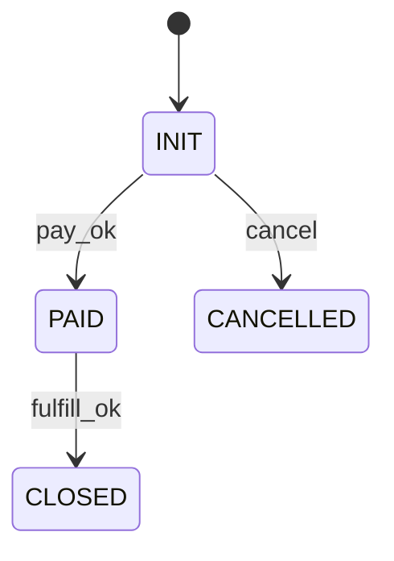

# 关系型（OLTP）表级详细设计文档模板

> **适用范围：** MySQL / PostgreSQL 等关系型 OLTP 场景；面向**单表**或**强耦合表组**（主表+明细、主表+扩展表等）的物理与行为设计。  
> **编写原则：** 本文档必须比“建表 DDL”更完整——除字段与索引外，必须明确 **CRUD 契约、幂等与并发、事务边界、禁止操作、批量与修复规则**，作为研发、测试、DBA、审计与排障的统一依据。

---

## 1. 文档信息

| 项目 | 内容 |
|------|------|
| 文档名称 | `{表名或表组名}` 关系型 OLTP 详细设计 |
| 逻辑库/Schema | 如：`retail_trade` / `public` |
| 物理库标识 | 如：`retail_trade_{shard}_{env}`；PostgreSQL 可写连接串或实例组 |
| 所属集群/实例 | 如：`cluster-trade-p0` / `pg-oltp-primary` |
| 设计对象 | 单表 / 强耦合表组（列出成员表） |
| 数据库产品 | MySQL / PostgreSQL |
| 数据库版本 | 如：`8.0.x` / `15.x` |
| 文档版本 | v1.0 |
| 编写日期 | YYYY-MM-DD |
| 编写人 | 姓名/团队 |
| 业务负责人 | 姓名 |
| DBA 负责人 | 姓名 |
| 安全/合规接口人 | 姓名（如涉及敏感与审计） |
| 最后更新 | YYYY-MM-DD |


---

### 1.1 变更记录

| 版本 | 日期 | 变更原因/依据 | 变更摘要 | 变更人 | 评审/批准 |
|------|------|---------------|----------|--------|-----------|
| v1.0 | YYYY-MM-DD | 初版 | 首次发布 | `{姓名}` | `{姓名}` |

### 1.2 术语定义

| 术语 | 说明 |
|------|------|
| OLTP | Online Transaction Processing，联机事务处理 |
| 幂等键 | 用于识别重复请求的业务键/请求号 |

### 1.3 参考文档

| 文档名 | 关联类型 | 参考说明 |
|------|------|------|
| [{文档名}] ({链接地址}) | 规范引用/设计依赖/附件/决策依据等 |说明该参考或关联文档与本文档提供的可参考内容或关系 |


---

## 2. 文档定位

### 2.1 编写目的

**应写明：**

- 本文档用于在 OLTP 语义下，把**一张表或一组强耦合表**的**业务含义、物理结构、访问契约、并发与一致性、分区归档与安全审计**落到可执行、可验收的规格。
- 本文档是**实现代码、集成测试、性能基线、发布脚本、运维操作**的输入；与概要设计分工为：概要定域与边界，详细定表级行为与约束。

**不应重复：**

- 不在此重复编写全系统级数据架构、跨域事件总线设计（可引用概要设计章节编号）。

### 2.2 设计对象类型

| 项目 | 内容 |
|------|------|
| 对象类型 | 单表 / 主表+明细 / 主表+扩展 / 配置表 / 幂等请求表 / 状态流水表 / 其他：`{说明}` |
| 是否核心业务表 | 是/否 |
| 是否强耦合表组 | 是（列出表名与关系）/ 否 |
| 是否多租户 | 是/否；租户隔离字段：`{tenant_id 等}` |
| 是否分区/分表 | 是/否；键：`{字段}` |
| 是否输出 CDC（binlog/WAL） | 是/否；消费方：`{说明}` |
| 是否含敏感字段 | 是/否 |
| 默认删除策略 | 物理删除 / 逻辑删除（字段：`{is_deleted}`）/ 禁止删除仅归档 |

### 2.3 与其他文档的关系

| 文档 | 关系 |
|------|------|
| 关系型 OLTP 概要设计 | 定义逻辑库、表组归属、跨表事务与一致性策略的**上层边界** |
| 数据字典 | **标准字段、枚举、命名、敏感等级**的权威来源；详细设计与之对齐或说明例外 |
| 变更管理 / 发布规范 | 表结构变更、数据修复、批处理任务的流程与审批 |
| API/领域服务设计 | 对外能力由服务暴露；**禁止绕过契约直接写库**的场景须在此声明 |

### 2.4 强耦合表组说明（若适用）

**何时填写：** 当设计对象为 **主表 + 明细 / 扩展 / 流水** 等一组表，且存在 **同事务、同生命周期、联合查询 P0 路径** 时，必须在本节列出成员与关系。

| 成员表 | 角色 | 与主表关系 | 同事务要求 | 备注 |
|--------|------|------------|------------|------|
| `{main}` | 主表 | — | — | 权威事实 |
| `{item}` | 明细 | N:1 `{fk}` | 创建/变更须同事务 | 金额汇总来源 |
| `{log}` | 流水/审计 | N:1 | 可与主表同事务或异步（须说明） | 不可删改规则见 §6 |

**一致性摘要：** `{一句话说明主明细如何对齐，例如：主表 total = sum(item.amount) 在事务内重算}`。

---

## 3. 业务语义与生命周期

### 3.1 表的业务职责（业务角色）

**编写要点：**

- 该表记录的是哪一种**业务事实**（订单、支付、库存流水、会员属性等）。
- 属于 **主数据 / 交易事实 / 状态快照 / 审计流水 / 辅助配置** 中的哪一类。
- 与上下游：**谁写入、谁读取、谁是权威数据源**。

**示例（请替换为真实业务）：**

```text
`{table}` 用于记录 {业务事实}，是 {领域} 内的 {主表/从表/流水}。
主键/业务键用于 {对外定位/幂等}；金额类字段以 {下单快照/实时汇总} 方式维护；
与 `{related_table}` 为 {1:N} 关系，创建与变更必须与 {约束} 一致。
```

### 3.2 核心业务场景

| 场景 ID | 场景名称 | 触发入口 | 主要 SQL 形态 | 优先级 | 频率/峰值 | 说明 |
|---------|----------|----------|---------------|--------|-----------|------|
| S01 | `{名称}` | `{接口/任务}` | INSERT/UPDATE/… | P0/P1 | `{QPS}` | `{备注}` |
| S02 | `{名称}` | `{接口/任务}` | SELECT … | P0 | `{QPS}` | 必带 `{条件}` |
| S03 | `{名称}` | `{任务}` | 批处理 UPDATE | P2 | `{TPS}` | 仅工单/受控脚本 |

### 3.3 数据生命周期阶段

| 阶段 | 进入条件 | 允许的操作类型 | 对外可见性 | 数据留存策略 |
|------|----------|----------------|------------|--------------|
| 创建中 | `{条件}` | 仅创建/幂等校验 | 不可见/内部可见 | `{保留策略}` |
| 生效中 | `{条件}` | 读、受控更新 | 按业务规则 | 在线库 |
| 结束态 | `{条件}` | 以只读为主；例外更新需写明 | 按业务规则 | 在线库 + 索引策略 |
| 归档态 | `{时间/条件}` | 只读或受限查询 | 走归档查询入口 | 归档库/冷存储 |
| 清理态 | `{法定或内控期限}` | 受控删除 | 不可见 | 审计留痕后清理 |

### 3.4 状态机（若存在状态字段）

**若无状态字段：** 写明“无状态机”，并说明是否用 **版本号、乐观锁、事件顺序号** 约束变更。

**若有状态字段：** 必须给出完整迁移表（或 Mermaid 状态图引用）。

| 当前状态（值/枚举名） | 允许迁移至 | 触发动作/事件 | 是否可回退 | 备注 |
|----------------------|------------|---------------|------------|------|
| `{INIT}` | `{PAID}` | 支付成功 | 否 | `{说明}` |
| `{PAID}` | `{CLOSED}` | 履约完成 | 否 | `{说明}` |

**禁止：** 未在状态机中列出的迁移一律视为非法，应用层与数据校验需一致拒绝。



---

## 4. 物理结构设计

### 4.1 建表级环境与约定

| 项目 | MySQL 建议 | PostgreSQL 建议 | 本文档取值 |
|------|------------|-----------------|------------|
| 存储引擎 / 表类型 | **InnoDB**（必选 OLTP） | 默认堆表 / 按需 | `{填写}` |
| 字符集 | **utf8mb4** | 数据库/库级 UTF8 | `{填写}` |
| 排序规则 | **utf8mb4_unicode_ci**（或团队统一） | `C` / `C.UTF-8` 等 | `{填写}` |
| 主键策略 | 自增 `BIGINT` / 雪花 ID / UUID（说明无序插入影响） | `BIGINT GENERATED`/序列/UUID | `{填写}` |
| 时间类型 | `DATETIME(3)` 或 `TIMESTAMP`（说明时区） | `TIMESTAMPTZ` 推荐 | `{填写}` |
| 金额类型 | `DECIMAL(p,s)`，禁止浮点 | `NUMERIC(p,s)` | `{填写}` |
| 默认隔离级别 | 与实例一致（如 RR/RC） | 与实例一致 | `{填写}` |
| 逻辑删除 | `is_deleted` + 默认值 0 | 同左或 RLS 另行说明 | `{填写}` |

**方言差异提示：** 同一设计若需双栈兼容，在附录“兼容性说明”中列出 **CHECK、部分索引、生成列** 等差异。

### 4.2 字段定义（含敏感级别）

**字段说明列至少包含：** 名称、业务含义、类型、空值、默认值、生成策略、敏感级别、是否参与索引、备注（含 **谁可写、何时可改**）。

| 序号 | 字段名 | 中文名 | 类型 | 必填 | 默认值 | 敏感级别 | 说明 |
|------|--------|--------|------|------|--------|----------|------|
| 1 | `id` | 主键 | `BIGINT` | 是 | 自增/序列 | 低 | 内部主键 |
| 2 | `{biz_key}` | 业务唯一键 | `VARCHAR(n)` | 是 | - | 低 | 幂等定位 |
| 3 | `{tenant_id}` | 租户 | `BIGINT` | 是 | - | 低 | 多租户必带 |
| 4 | `{status}` | 状态 | `SMALLINT`/`枚举` | 是 | `{默认}` | 低 | 受状态机约束 |
| 5 | `{amount}` | 金额 | `DECIMAL(18,2)` | 是 | `0` | 中 | 应用+约束校验 |
| 6 | `{phone}` | 手机号 | `VARCHAR(32)` | 条件必填 | - | **高** | 加密/脱敏策略见 §9 |
| 7 | `create_time` | 创建时间 | `DATETIME(3)` / `TIMESTAMPTZ` | 是 | `CURRENT_TIMESTAMP` | 低 | 分区/排序 |
| 8 | `update_time` | 更新时间 | 同左 | 是 | 自动更新 | 低 | 由触发器/应用维护 |
| 9 | `version` | 乐观锁版本 | `INT` | 是 | `1` | 低 | 并发更新 |

**敏感级别定义（示例，对齐组织数据字典）：**

| 级别 | 说明 | 存储 | 展示 | 日志 |
|------|------|------|------|------|
| 低 | 非个人信息 | 明文 | 明文 | 可打 INFO |
| 中 | 业务敏感 | 明文+权限 | 按角色 | 脱敏 |
| 高 | PII/强监管 | 加密/令牌化 | 脱敏/最小化 | 禁止完整输出 |
| 极高 | 密钥类 | KMS/专用方案 | 不可展示 | 禁止 |

### 4.3 索引设计

| 索引名 | 类型 | 字段（顺序敏感） | 唯一 | 服务场景 | 备注 |
|--------|------|------------------|------|----------|------|
| `PRIMARY` | 主键 | `id` | 是 | 内部关联 | — |
| `uk_{biz}` | 唯一 | `{tenant_id, biz_key}` 或单列 | 是 | 幂等/对外查询 | 注意租户前缀 |
| `idx_{list}` | 二级 | `{tenant_id, status, create_time}` | 否 | 列表/后台 | 避免低选择性首列 |

**编写要求：**

- 说明 **覆盖索引** 是否刻意为之；避免冗余索引。
- 写清楚 **联合索引最左前缀** 与业务 WHERE 顺序的对应关系。
- PostgreSQL：标明 **部分索引（WHERE）**、**INCLUDE** 若使用。

### 4.4 约束与数据库对象

| 类别 | 规则 | 实现方式 | 备注 |
|------|------|----------|------|
| 主键 | 唯一且非空 | `PRIMARY KEY` | — |
| 业务唯一 | `{条件}` 下唯一 | `UNIQUE` / 应用保证 | 分库分表时注意全局唯一策略 |
| 检查约束 | 金额非负、状态枚举 | `CHECK`（若版本支持）+ 应用校验 | MySQL 8.0+ 支持 CHECK |
| 外键 | 默认 **OLTP 高并发分片场景慎用** | 应用层引用完整性 | 若使用外键需评估锁与 DDL |
| 默认值 | 状态、时间、版本 | `DEFAULT` + 应用一致 | 迁移时注意回填 |

### 4.5 字段可变性矩阵

| 字段 | 创建时赋值 | 运行中可改 | 结束态可改 | 修改主体 | 约束/备注 |
|------|------------|------------|------------|----------|-----------|
| `{biz_key}` | 是 | **否** | **否** | — | 业务锚点 |
| `{tenant_id}` | 是 | **否** | **否** | — | 隔离锚点 |
| `{status}` | 是 | 是（仅允许迁移） | **否** | 领域服务 | 状态机 |
| `{amount}` | 是 | 条件可改 | **否**/受限 | 领域服务 + 审批 | 与明细一致 |
| `create_time` | 自动 | **否** | **否** | — | 审计锚点 |

### 4.6 技术实现依赖（本表必选清单）

| 依赖项 | 版本/规格 | 本文档是否依赖 | 说明 |
|--------|-----------|----------------|------|
| 数据库大版本 | `{如 MySQL 8.0.36}` | 是 | 影响 CHECK、默认索引类型等 |
| 客户端驱动 | `{connector 版本}` | 视需要 | 预处理语句、批处理行为 |
| 中间件路由 | `{ShardingSphere / 自研}` | 视需要 | 路由键与唯一键全局性 |
| 字符集/排序规则 | utf8mb4 + 统一 collation | 是 | 与索引、比较语义一致 |

**禁止：** 在未写入本文档与变更单的情况下，引入仅某补丁版本可用的特性。

---

## 5. 数据量与性能设计

### 5.1 数据量估算

| 维度 | 估算值 | 说明 |
|------|--------|------|
| 当前总行数 | `{N}` 万/亿 | 截止 `{日期}` |
| 日均新增行数 | `{N}` 万 | 含峰值说明 |
| 峰值日增 | `{N}` 万 | 如：大促、特殊活动 |
| 年增长率 | `{pct}%` | 基于业务预测 |
| 3 年预计总行数 | `{N}` 亿 | 含增长假设 |
| 单行平均大小 | `{bytes}` 字节 | 含索引估算 |
| 3 年预计磁盘占用 | `{N}` GB/TB | 数据+索引+冗余 |

### 5.2 读写 QPS 与延迟 SLA

| 场景 ID | 场景名称 | 操作类型 | QPS/TPS 目标 | P99 延迟目标 | 优先级 | 说明 |
|---------|----------|----------|-------------|-------------|--------|------|
| S01 | `{场景}` | INSERT | `{TPS}` | `{ms}` | P0 | `{备注}` |
| S02 | `{场景}` | SELECT（点查） | `{QPS}` | `{ms}` | P0 | 必带主键/唯一键 |
| S03 | `{场景}` | SELECT（列表） | `{QPS}` | `{ms}` | P1 | 分页+索引 |
| S04 | `{场景}` | UPDATE | `{TPS}` | `{ms}` | P0 | 乐观锁 |

**延迟 SLA 说明：** P99 指第 99 百分位延迟；P0 场景建议 P99 < 50ms（点查）/ < 200ms（列表）；允许在大促等极端场景短时突破，须提前报备。

### 5.3 热点与数据倾斜分析

| 热点类型 | 表现 | 发生条件 | 缓解措施 |
|----------|------|----------|----------|
| 写热点 | 特定分片/分区写入集中 | `{条件}` | `{措施：如分散键、本地缓冲}` |
| 读热点 | 少量行被高频访问 | `{条件}` | `{措施：如 Redis 缓存、只读副本}` |
| 数据倾斜 | 大租户数据量远超小租户 | `{条件}` | `{措施：如独立分片、限流}` |

### 5.4 容量规划

| 资源 | 估算方法 | 目标值 | 说明 |
|------|----------|--------|------|
| 磁盘（数据+索引） | 单行 × 行数 × 冗余系数 | `{N}` GB/TB | 含备份空间 |
| InnoDB Buffer Pool | 热数据量 × 系数 | `{N}` GB | 建议覆盖热数据索引 |
| 连接数 | 应用实例 × 连接池 | `{N}` | 含监控/运维预留 |
| IOPS | 峰值 QPS × IO 放大 | `{N}` | SSD 场景参考 |

### 5.5 性能保障措施

| 措施 | 适用场景 | 实施状态 | 说明 |
|------|----------|----------|------|
| 索引覆盖 P0 查询 | 全部 P0 查询 | `{已/待实施}` | 见 §4.3 |
| Redis 缓存 | 高频读场景 | `{已/待实施}` | Key 设计见缓存设计文档 |
| 读写分离 | 列表/报表查询 | `{已/待实施}` | 从库延迟可接受范围 |
| 分区裁剪 | 按时间范围查询 | `{已/待实施}` | 见 §8.2 |
| 连接池优化 | 高并发场景 | `{已/待实施}` | 短连接避免连接风暴 |

---

## 6. CRUD 契约设计（OLTP 核心）

> **契约含义：** 任何访问本表的代码路径须满足本节；**禁止操作**与**批处理规则**具有与 DDL 同等效力。  
> **幂等：** 须明确 **业务幂等键**（请求号、业务单号、Token）与 **数据库唯一约束** 的对应关系。

### 6.1 CRUD 总览矩阵

| 操作 | 典型入口 | 定位键/幂等键 | 必备前置条件 | 允许字段/投影 | 明确禁止 | 并发控制 | 审计 |
|------|----------|---------------|--------------|---------------|----------|----------|------|
| **C** | `{API}` | `{idempotency_key}` + `UNIQUE` | 租户、参数校验 | 创建字段集合 | 手写系统字段 | 唯一冲突即幂等返回 | 创建来源 |
| **R** | `{API}` | 业务键 + 租户 | 租户过滤 | 列白名单 | `SELECT *` 大查询 | 读写分离规则 | 敏感字段访问 |
| **U** | `{API}` | 业务键 + `version`/状态 | 状态合法 | 可变态 | 改锚点字段 | 乐观锁/条件更新 | 前后镜像 |
| **D** | `{API/任务}` | 业务键 | 生命周期允许 | 逻辑删除列 | 在线物理删 | 条件更新 | 原因码 |

### 6.2 强制前置条件（Mandatory Conditions）

> **用途：** 供代码评审与测试用例直接引用；每一条应对应至少一条自动化测试或契约测试。

| 操作 | 编号 | 强制条件（不满足则拒绝） | 错误码/HTTP 建议 |
|------|------|---------------------------|------------------|
| Create | MC-C1 | 鉴权通过且 `tenant_id` 与令牌一致 | `{401/403}` |
| Create | MC-C2 | `{biz_key}` 符合格式且未占用（或幂等命中） | `{409}` |
| Read | MC-R1 | 列表/详情必须带 `tenant_id`（多租户） | `{400}` |
| Update | MC-U1 | 当前 `status` 在允许迁移集合内 | `{409}` |
| Update | MC-U2 | `version` 与库中一致（乐观锁） | `{409}` |
| Delete | MC-D1 | 满足生命周期与审批策略 | `{403/409}` |

### 6.3 禁止操作清单（Prohibited Operations）

| 编号 | 禁止行为 | 适用范围 | 例外（须工单+审批） |
|------|----------|----------|---------------------|
| PO-01 | 无 `WHERE` 的 `UPDATE`/`DELETE` | 全部环境 | 不存在 |
| PO-02 | 修改 `id` / `{biz_key}` / `tenant_id` / `create_time` | 生产 | 仅迁移/纠错脚本 |
| PO-03 | 业务代码 **物理删除** 在线事实行 | 生产 | 归档后清理任务 |
| PO-04 | 绕过服务层直接写核心表 | 生产 | DBA 紧急修复 |
| PO-05 | 导出含高敏感列的宽表至非受控环境 | 全部 | 安全审批+加密通道 |

### 6.4 Create（创建）

| 规则项 | 要求 |
|--------|------|
| 调用方必填 | `{字段列表}` |
| 系统生成 | `id`、`create_time`、`update_time`、`version` 等 |
| 幂等策略 | 同一 `{幂等键}` 重复提交 → 返回同一业务结果；依赖 `uk_*` 或幂等表 |
| 事务边界 | 强耦合表组：主表与明细/流水 **同事务提交**；失败全回滚 |
| 失败语义 | 唯一冲突：映射为成功查询或业务码 `{XXX}`；不得产生半笔主明细 |

**禁止：**

- 调用方指定 `id`（除非分布式 ID 规范允许且全局唯一）。
- 跳过 `{tenant_id}` 或租户由客户端隐式推断且无鉴权链。
- 信任外部传入金额/数量而不做 **服务端重算与校验**。

### 6.5 Read（读取）

| 查询类型 | 必带条件 | 推荐索引 | 主库/只读 | 备注 |
|----------|----------|----------|-----------|------|
| 单笔详情 | `tenant_id` + 业务键 | `uk_*` | 写后读走主库 | 可指定 `MASTER`  hint（按框架） |
| 列表分页 | `tenant_id` + 过滤 + 时间窗 | `idx_*` | 可从库 | 推荐 **游标/seek** 分页 |
| 对账/风控 | 业务键或窄时间窗 | 专用索引 | 主库或同步副本 | 禁止大扫表 |

**禁止：**

- 无租户条件的全表扫描（多租户场景）。
- 深 OFFSET；大结果集不分批导出。
- 将 OLTP 表当作报表源直扫；应走汇总表或 OLAP。

### 6.6 Update（更新）

| 场景 | 前置条件 | 允许 SET 字段 | 禁止 SET 字段 | 并发 |
|------|----------|---------------|---------------|------|
| 状态迁移 | 当前状态 ∈ 合法集合 | `status`、`update_time`、`version` | `biz_key`、`create_time` | `WHERE version=?` |
| 业务补录 | 授权角色 + 业务规则 | `{白名单}` | 金额锚点（除非专项流程） | 乐观锁 |

**禁止：**

- `UPDATE` 无 `WHERE` 或仅非索引条件。
- 批量更新核心事实表无 **行数上限、分批、工单**。
- 绕过状态机直接写终态。

### 6.7 Delete（删除）

| 操作 | 策略 | 前置条件 | 审批 |
|------|------|----------|------|
| 业务删除 | 逻辑删除优先 | 状态允许 | 标准 |
| 归档清理 | 先归档再删/迁 | 超保留期 | 变更单 |
| 物理删除 | 极少 | 已归档 + 法定期限 | 高风险 |

### 6.8 幂等键与重复请求

| 层级 | 机制 | 说明 |
|------|------|------|
| API | `Idempotency-Key` / 业务请求号 | 网关或服务缓存短期去重 |
| DB | `UNIQUE(tenant_id, biz_no)` | 最终以数据库为准 |
| 消息 | 消费者 `msg_id` 去重表 | 与业务表配合 |

### 6.9 批量操作与数据修复规则

| 类型 | 允许条件 | 事务与批次 | 记录要求 |
|------|----------|------------|----------|
| 批量修正 | 工单 + 脚本版本 | 每批 ≤ `{N}` 行；单批失败可重入 | 影响行数、样本校验 |
| 全表迁移 | 停机/双写方案 | 另行专项设计 | DBA 执行证据 |
| 临时手工 SQL | **默认禁止** | — | 若紧急，需审批+留痕 |

**原则说明（可粘贴到评审）：**

```text
核心 OLTP 事实表的批量更新必须可分批、可重试、可核对；禁止在生产环境无工单 ad-hoc 更新。
数据修复须先备份/快照、样本对比、回滚语句，并在审计系统登记工单号与执行人。
```

---

## 7. 事务、一致性与并发控制

### 7.1 本地事务边界（单库）

| 场景 ID | 参与表/对象 | 一致性要求 | 提交/回滚 |
|---------|-------------|------------|-----------|
| T01 | `{主表}+{明细}` | 强一致 | 单事务 |
| T02 | `{主表}+{流水}` | 强一致 | 单事务 |
| T03 | 仅主表 | 强一致 | 单事务 |

### 7.2 跨表一致性（表组内/跨库）

| 关系 | 策略 | 补偿/核对 |
|------|------|-----------|
| 同库主明细 | 同事务 | 日终一致性校验任务 |
| 跨库 | **Saga/本地消息表/TCC**（选其一并说明） | 对账任务、幂等重试 |
| 读侧延迟 | 明确 **允许延迟** 的场景 | 禁止用于资金最终状态展示 |

### 7.3 并发控制

| 场景 | 策略 | 说明 |
|------|------|------|
| 一般更新 | **乐观锁** `version` | `UPDATE … WHERE version=?` |
| 高竞争扣减 | 单行 `UPDATE … WHERE qty>=?` 或专用服务 | 评估死锁与重试 |
| 幂等插入 | `UNIQUE` + 捕获冲突 | 返回已有记录 |

### 7.4 数据质量校验（在线/离线）

| 校验项 | 规则 | 频率 | 失败处理 |
|--------|------|------|----------|
| 主明细金额 | 主表 = SUM(明细) | 定时 | 告警 + 修复工单 |
| 状态合法 | ∈ 枚举 | 定时 | 阻断下游同步 |
| 孤儿记录 | 明细必有主 | 定时 | 修复或人工 |

### 7.5 隔离级别、死锁与重试约定

| 主题 | 约定 |
|------|------|
| 默认隔离级别 | 与实例一致（MySQL 常见 `REPEATABLE READ` / `READ COMMITTED`）；若依赖 **幻读语义** 须在代码与测试中明示 |
| 读已提交 vs 可重复读 | 写后读、防脏读为底线；若用 RC，须在应用层处理 **不可重复读** 对业务的影响 |
| 死锁 | 高竞争场景统一 **锁顺序**（先主后明、按主键排序更新）；捕获死锁错误码后 **有限次退避重试**（记录 trace_id） |
| 长事务 | 禁止在 OLTP 长事务中混合 **外部 HTTP/RPC**；批处理拆批并设超时 |

### 7.6 跨表最终一致（若异步）

| 步骤 | 动作 | 失败补偿 |
|------|------|----------|
| 1 | 本地事务提交主事实 | — |
| 2 | 发送消息/写 outbox 表 | 重试 + 幂等消费 |
| 3 | 下游更新读模型 | 对账任务修正 |

---

## 8. 分区、分片与归档设计

### 8.1 路由与分片规则

| 项目 | 内容 |
|------|------|
| 分片键 | `{字段}`；选取理由：`{高基数/查询模式}` |
| 路由算法 | 哈希 / 范围 / 中间件规则 `{规则}` |
| 全局唯一 | `biz_key` 是否全局唯一；若分库如何保证 |

### 8.2 分区策略（若使用）

| 维度 | MySQL | PostgreSQL |
|------|-------|------------|
| 分区类型 | RANGE/LIST/HASH（说明） | RANGE/LIST + 声明式分区 |
| 分区键 | 通常时间或组合 | 同左 |
| 跨分区查询 | 必须限制时间窗 | 同左 |

### 8.3 查询策略

| 场景 | 是否带路由/分区键 | 预期计划 | 禁止 |
|------|-------------------|----------|------|
| 点查 | 是 | 点查索引 | — |
| 跨月 | 明确时间范围 | 分区裁剪 | 无界扫描 |

### 8.4 归档与保留

| 阶段 | 条件 | 目标存储 | 在线库策略 |
|------|------|----------|------------|
| 归档 | `{N}` 天/月前且状态终态 | 归档库/OSS | 删或迁 |
| 清理 | 法定期限 | 物理删除 | 审计通过后 |

### 8.5 冷热分离与只读副本

| 数据类别 | 放置 | 查询入口 | 说明 |
|----------|------|----------|------|
| 热数据 | 在线库 | 主路径 API | 默认 |
| 温数据 | 在线库分区/归档表 | 带时间窗查询 | 控制扫描范围 |
| 冷数据 | 归档库/对象存储 | 离线任务/专用查询 | 禁止与热路径混用 |
| 报表 | 汇总表/OLAP | BI 账号 | 禁止直连核心 OLTP 大表扫 |

**读写分离：** 写后读默认 **主库**；允许从库的查询须列出 **可接受延迟（秒级）** 与 **降级策略**。

---

## 9. 安全与审计设计

### 9.1 敏感字段清单

| 字段 | 级别 | 存储 | 应用展示 | 导出 |
|------|------|------|----------|------|
| `{field}` | 高 | `{加密方式}` | 脱敏 | 禁止/审批 |

### 9.2 脱敏与掩码规则

| 场景 | 规则 | 示例 |
|------|------|------|
| 手机号 | 保留前3后4 | `138****5678` |
| 证件号 | 保留末4位 | `**********1234` |

### 9.3 访问控制

| 角色 | 读 | 写 | 说明 |
|------|----|----|------|
| 应用账号 `{app_rw}` | 白名单列 | 白名单列 | 最小权限 |
| 只读账号 `{app_ro}` | 允许 | 禁止 | 报表/BI |
| DBA 运维 | 审批后 | 变更窗口 | 双人复核 |

### 9.4 审计要求

| 事件 | 记录内容 | 保留期 |
|------|----------|--------|
| 敏感字段访问 | 操作者、对象、时间、原因码 | `{N}` 年 |
| 数据修复 | 工单、脚本版本、影响行、校验截图 | 永久/按规范 |
| 管理端导出 | 审批单、导出人、范围 | `{N}` 年 |

---

## 10. 测试与验收

### 10.1 验收检查表

| 检查项 | 结果 | 备注 |
|--------|------|------|
| 与概要设计库表边界一致 | ☐ | |
| InnoDB / utf8mb4（或 PG 等价）已声明 | ☐ | |
| 字段与数据字典一致（含敏感级别） | ☐ | |
| 索引覆盖 P0 查询 | ☐ | |
| CRUD 契约、禁止项、批量规则完整 | ☐ | |
| 状态机/可变性矩阵可测试 | ☐ | |
| 幂等键与唯一约束对齐 | ☐ | |
| 事务边界与补偿策略明确 | ☐ | |
| 分区/归档策略与运维一致 | ☐ | |
| 安全与审计要求可落地 | ☐ | |
| 强制前置条件 MC-* 有对应用例 | ☐ | |
| 禁止操作 PO-* 有反向用例 | ☐ | |
| 批处理行数上限与工单流程验证 | ☐ | |
| PostgreSQL/MySQL 方言差异已评审（若双栈） | ☐ | |

### 10.2 测试用例类型

| 类型 | 目的 | 示例 |
|------|------|------|
| 正向 | 主路径 | 创建成功、状态合法迁移 |
| 反向 | 非法输入 | 缺租户、非法状态跳转 |
| 幂等 | 重复提交 | 同键重复创建仅一条 |
| 并发 | 竞争 | 双写同单、乐观锁冲突 |
| 批处理 | 边界 | 批次上限、失败重试 |
| 归档 | 生命周期 | 归档后查询路径 |
| 安全 | 越权 | 跨租户 ID 访问、脱敏绕过 |
| 兼容 | 方言 | PG 与 MySQL 同一契约下的参数与类型 |

### 10.3 样例 SQL（MySQL 风格，可按项目替换）

**幂等创建前存在性检查：**

```sql
SELECT `id`, `{biz_key}`, `version`
FROM `{schema}`.`{table}`
WHERE `tenant_id` = ?
  AND `{biz_key}` = ?
  AND `is_deleted` = 0;
```

**带乐观锁的条件更新：**

```sql
UPDATE `{schema}`.`{table}`
SET `{status}` = ?,
    `update_time` = CURRENT_TIMESTAMP(3),
    `version` = `version` + 1
WHERE `tenant_id` = ?
  AND `{biz_key}` = ?
  AND `version` = ?
  AND `is_deleted` = 0;
```

**列表查询（Seek 分页示例）：**

```sql
SELECT `{biz_key}`, `{status}`, `create_time`
FROM `{schema}`.`{table}`
WHERE `tenant_id` = ?
  AND `create_time` < ?
  AND `is_deleted` = 0
ORDER BY `create_time` DESC
LIMIT ?;
```

**逻辑删除（若启用 `is_deleted`）：**

```sql
UPDATE `{schema}`.`{table}`
SET `is_deleted` = 1,
    `update_time` = CURRENT_TIMESTAMP(3),
    `version` = `version` + 1
WHERE `tenant_id` = ?
  AND `{biz_key}` = ?
  AND `is_deleted` = 0
  AND `version` = ?;
```

**插入（字段显式列举，避免默认值漂移）：**

```sql
INSERT INTO `{schema}`.`{table}`
  (`{biz_key}`, `tenant_id`, `{status}`, `version`, `is_deleted`)
VALUES (?, ?, ?, 1, 0);
```

**PostgreSQL 提示：** 将 `CURRENT_TIMESTAMP(3)` 换为 `NOW()` 或 `clock_timestamp()`；根据方言调整反引号与 Schema 限定；`INSERT … ON CONFLICT` 可作为幂等插入方案并在 §6.8 与唯一约束对齐。

---

## 11. 附录

### 11.1 DDL SQL（定稿区）

> 将**最终**建表/改表 DDL 粘贴于此；须与正文 **字段、索引、约束** 完全一致。变更请走版本历史。

```sql
-- MySQL 示例骨架（请替换为实际 DDL）
CREATE TABLE `{table}` (
  `id` BIGINT NOT NULL AUTO_INCREMENT,
  `{biz_key}` VARCHAR(64) NOT NULL,
  `tenant_id` BIGINT NOT NULL,
  -- ...
  `create_time` DATETIME(3) NOT NULL DEFAULT CURRENT_TIMESTAMP(3),
  `update_time` DATETIME(3) NOT NULL DEFAULT CURRENT_TIMESTAMP(3) ON UPDATE CURRENT_TIMESTAMP(3),
  `version` INT NOT NULL DEFAULT 1,
  `is_deleted` TINYINT NOT NULL DEFAULT 0,
  PRIMARY KEY (`id`),
  UNIQUE KEY `uk_tenant_biz` (`tenant_id`, `{biz_key}`)
) ENGINE=InnoDB DEFAULT CHARSET=utf8mb4 COLLATE=utf8mb4_unicode_ci;
```

### 11.2 兼容性说明（MySQL / PostgreSQL）

| 主题 | 注意点 |
|------|--------|
| CHECK 约束 | MySQL 8.0.16+ 强制执行；PG 原生支持 |
| 索引类型 | PG 的 GIN/GIST 用于 JSONB/全文；勿与 OLTP 主路径混用无设计 |
| 分区 DDL | 语法与限制因产品而异；迁移需双轨验证 |
| 序列与 ID | 自增 vs `IDENTITY` vs 雪花；回填与复制冲突 |
| 大小写/引用 | PG 未加引号会折叠为小写；统一命名策略 |
| `NULL` 与唯一索引 | 多列唯一时 NULL 行为因版本/索引类型而异；业务键慎用 NULL |
| 隐式类型转换 | 比较时类型不一致可能导致 **索引失效**；参数绑定与列类型一致 |
| 批插入 | `LOAD DATA` / `COPY` 与触发器、复制延迟；大批量走离线通道 |

---

**文档结束**

