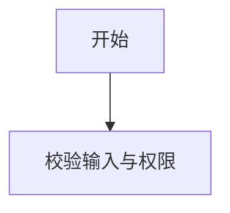
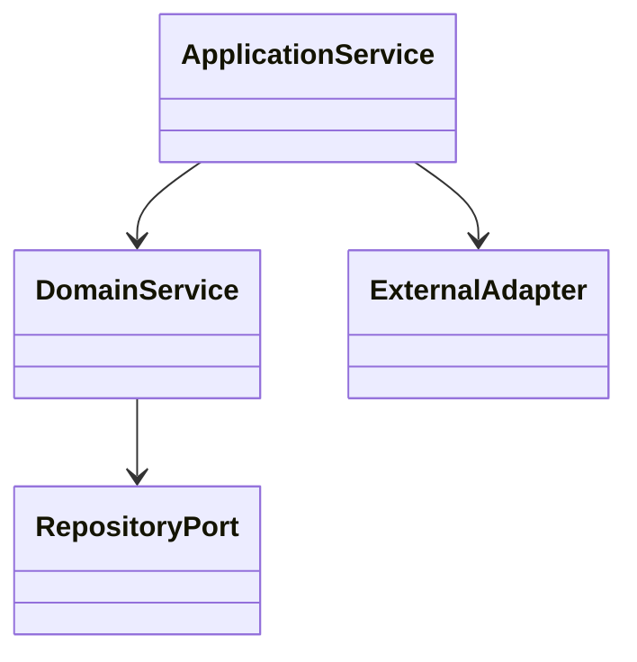

# 详细设计

## 1. 文档元数据

## 2. 设计规则或设计规范

## 3. 关联专项设计文档
| 专项 | 文档 | 说明 |
| --- | --- | --- |
| 数据库设计 | `database-design.md` | 表级 OLTP/OLAP 设计、字段、索引、CRUD 契约、并发和修复规则 |
| MQ 设计 | `mq-design.md` | 生产者、消费者、消息体、队列、死信、重试、回放和监控 |
| Redis 设计 | `redis-design.md` | Key、Value、TTL、容量、降级和运维 |
| 接口契约 | `interface-contracts.yaml` | 请求响应、处理上限和消息 contract |
| 测试策略 | `test-strategy.md` | 单元、集成、性能、稳定性和回归测试 |

## 4. 模块边界

## 5. 同步/异步或核心策略规则

## 6. 流程图与流程设计

### 6.1 <流程名称>

流程设计说明：

- 业务规则：
- 校验规则：
- 事务边界：
- 幂等与一致性：
- 异常场景：
- 日志要求：
- 取消、重试、补偿、文件清理：

## 7. DDD/UML 类图

## 8. 状态机

## 9. SDK/服务契约

## 10. 接口设计

## 11. 兼容策略

## 12. 单元测试设计

## 13. 人工评审项
