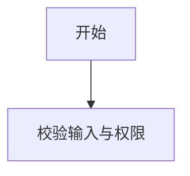
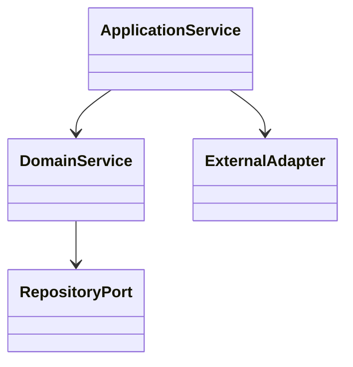

# [项目/模块名称] 详细设计说明书

## 1. 修订历史

| 版本号 | 修订日期 | 修订人 | 修订描述 |
| --- | --- | --- | --- |
| V1.0 | YYYY-MM-DD |  | 初稿创建 |

## 2. 设计背景与目标摘要

- 关联概要设计：`high-level-design.md`
- 核心目标摘要：

## 3. 模块/功能详细设计

### 3.1. 业务流程图

流程设计说明：

- 业务规则：
- 校验规则：
- 事务边界：
- 幂等与一致性：
- 异常场景：
- 日志要求：
- 取消、重试、补偿、文件清理：

### 3.2. UML类图

类图说明：

## 4. 数据库设计

| 设计项 | 关联文档 | 说明 |
| --- | --- | --- |
| 数据库专项设计 | `database-design.md` | 关联关系型 OLTP/OLAP 数据库模板，不在主详细设计展开字段和索引 |

## 5. 接口定义

### 5.1. API接口列表

| 接口名称 | YApi链接 | 接口路径 | 说明 |
| --- | --- | --- | --- |
|  |  |  |  |

### 5.2. 中间件设计

| 中间件 | 是否涉及 | 关联文档 | 评审要求 |
| --- | --- | --- | --- |
| MQ | 是/否 | `mq-design.md` | 遵循 MQ 设计模板并完成对应评审 |
| Redis | 是/否 | `redis-design.md` | 遵循 Redis 设计模板并完成对应评审 |

## 6. 单元测试

| 测试对象 | 正常流程 | 分支流程 | 异常流程 | 断言 |
| --- | --- | --- | --- | --- |
|  |  |  |  |  |

## 7. 性能与扩展性设计

## 8. 人工评审项
