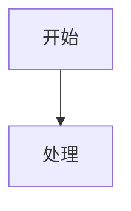

# <系统/项目名称>概要设计

## 1. 版本变更记录

| 版本 | 日期 | 变更内容 | 作者 | 评审/批准 |
| --- | --- | --- | --- | --- |
| V1.0 | YYYY-MM-DD | 初版 |  |  |

## 2. 平台概述

## 3. 系统设计

### 3.1 系统逻辑视图

### 3.1.1 系统设计原则

### 3.3 研发视图

### 3.4 研发结构定义

## 4. 核心功能

### 4.1 <核心功能名称>

#### 4.1.1 参与系统与职责设计

| 系统 | 职责 |
| --- | --- |
|  |  |

#### 4.1.2 核心流程

#### 4.1.3 状态机设计

| 状态 | 条件 | 动作 |
| --- | --- | --- |
|  |  |  |

#### 4.1.4 异常流与最终一致性

## 5.中间件设计

| 类型 | 是否涉及 | 专项文档 | 说明 |
| --- | --- | --- | --- |
| Redis | 是/否 | `redis-design.md` |  |
| MQ | 是/否 | `mq-design.md` |  |
| 定时任务 | 是/否 |  |  |
| 外部依赖 | 是/否 |  |  |

## 6.数据视图

| 数据对象 | 类型 | 权威来源 | 专项文档 | 说明 |
| --- | --- | --- | --- | --- |
|  | 事实表/读模型/缓存/消息 |  | `database-design.md` |  |
